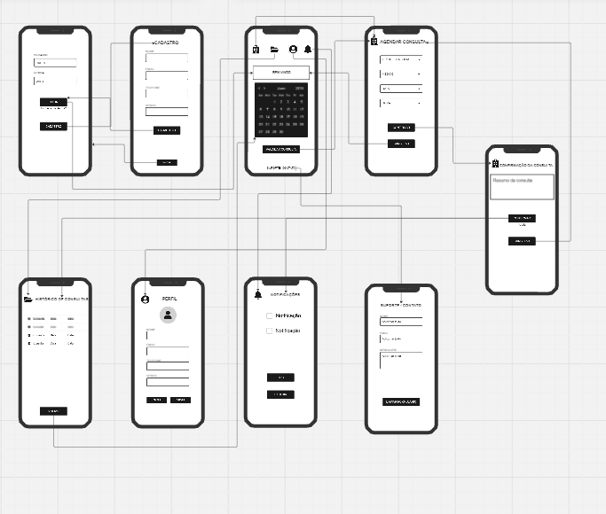
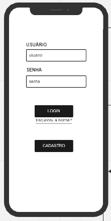
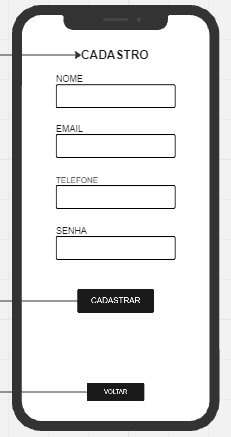
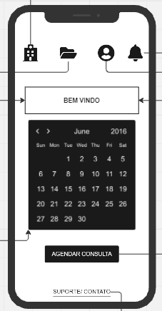
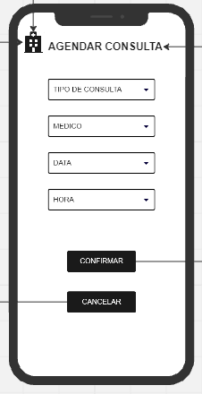
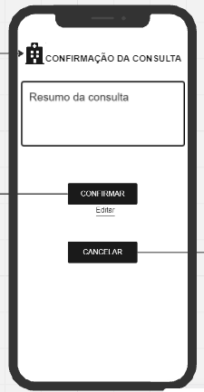
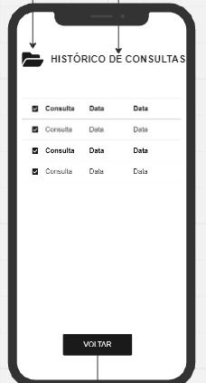
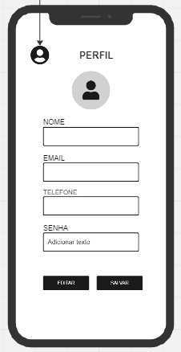
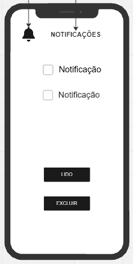
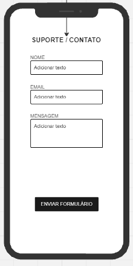

MARIA DA CONCEIÇÃO FREITAS LOPES - 2023011420
O sistema de agendamento de consultas médicas foi projetado para permitir que pacientes agendem, visualizem e gerenciem suas consultas com facilidade, em dispositivos móveis. O sistema inclui funcionalidades como login e cadastro de usuários, agendamento de consultas, histórico de consultas, notificações, suporte ao usuário e mensagens.

•
Tela de login
Inclui campos de entrada para Email ou nome de usuário e senha, com botão para login, recuperação de senha e cadastro de novos usuários. Justificativa: A tela de login foi simplificada para facilitar o acesso dos usuários.

Tela de cadastro
Possui campos para nome completo, Email, telefone e senha, há botões para cadastro e retorno a tela de login. Justificativa: A tela de cadastro foi projetada para ser intuitiva, garantindo que novos usuários possam se registrar se dificuldade.

•
Tela inicial
Exibe uma barra de navegação superior com ícones para agendar consultas, histórico de consultas, perfil do usuário e notificações. Inclui um módulo de boas-vindas, um calendário interativo, um botão para agendar novas consultas e link para suporte / contato. Justificativa: O design da tela inicial foi feito para centralizar as principais funcionalidade do sistema, facilitando o acesso rápido às ações mais importantes, a inclusão de boas-vindas melhora a experiência do usuário, criando uma interface amigável e acolhedora.

Tela de agendamento de consultas
Contém campos de seleção para o tipo de consulta, médico, data e hora, além de botões para confirmar ou cancelar o agendamento. Justificativa: A tela de agendamento foi estruturada para ser funcional e clara, permitindo ao usuário agendar suas consultas com poucos cliques.

•
Tela de confirmação de consulta
Fornece um resumo do agendamento com detalhes sobre a data, hora e médico, além de botões para confirmar, editar ou cancelar a consulta. Justificativa: A tela de confirmação assegura que o usuário possa revisar todos os detalhes antes de finalizar o agendamento, reduzindo a chance de erros.

Tela de histórico de consultas
Lista as consultas passadas onde apresenta o tipo de consulta e data em que elas foram realizadas. Justificativa:
Essa tela permite ao usuário acessar rapidamente seu histórico médico, o que pode ser crucial para acompanhamento e referência.

Tela de Perfil
Apresenta informações pessoais como nome, Email, telefone e senha, com botões para editar e salvar alterações. Justificativa: O design da tela de perfil foi pensado para ser simples e direto, permitindo ao usuário atualizar suas informações pessoais com facilidade.

Tela de notificações
Exibe uma lista de notificações, como lembretes de consultas e mensagens do médico, com botões para marcar como lido ou excluir. Justificativa: As notificações foram incluídas para garantir que os usuários não percam compromissos importantes, melhorando a gestão de suas consultas.

Tela de suporte/contato
Inclui um formulário de contato, com opção de envio de mensagem. Justificativa: O suporte ao usuário foi integrado para oferecer ajuda imediata e resolver problemas de forma rápida, aumentando a satisfação do usuário.

